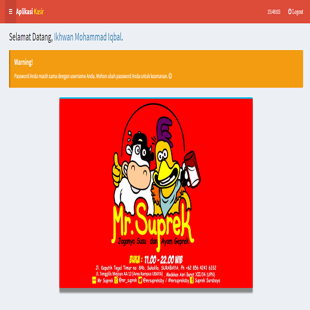
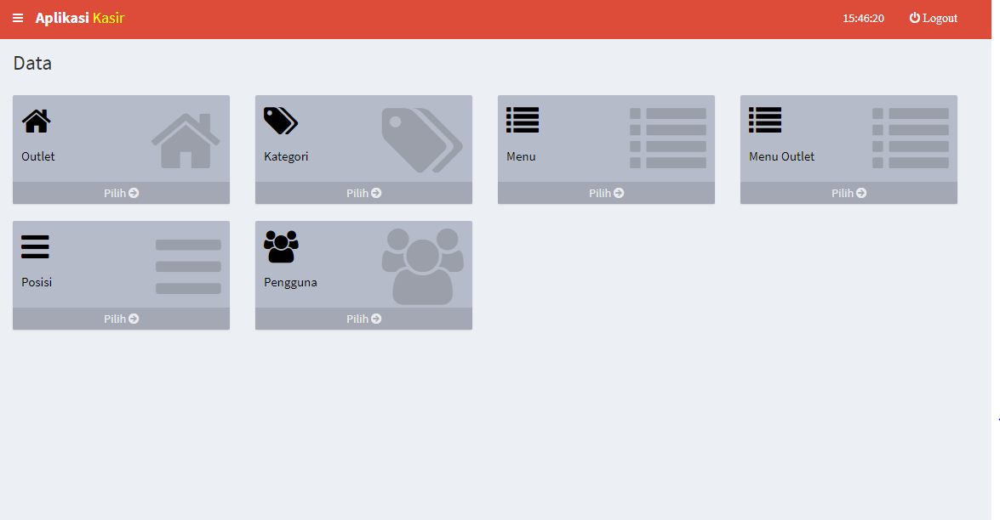
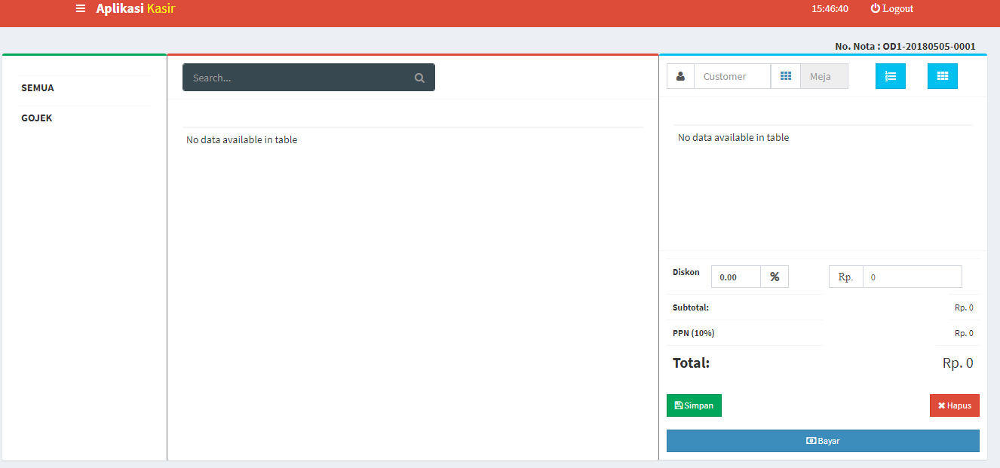
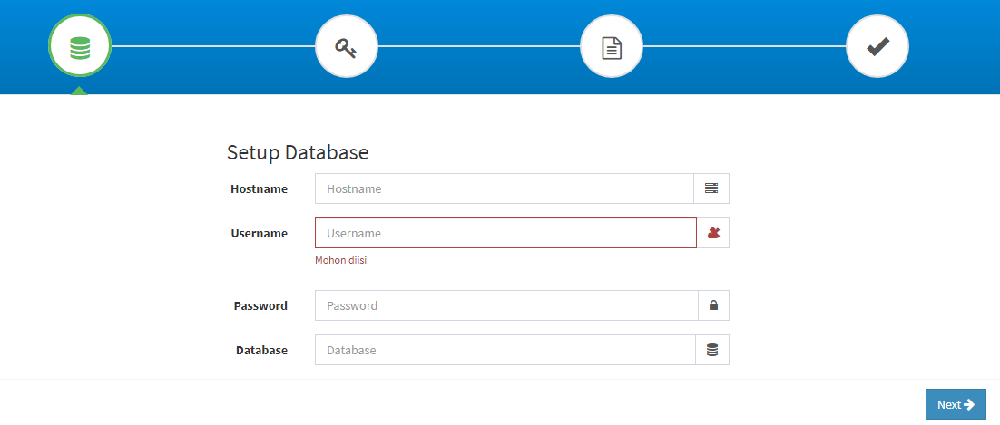
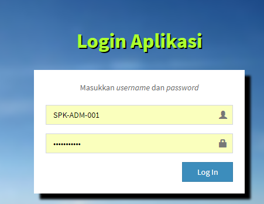
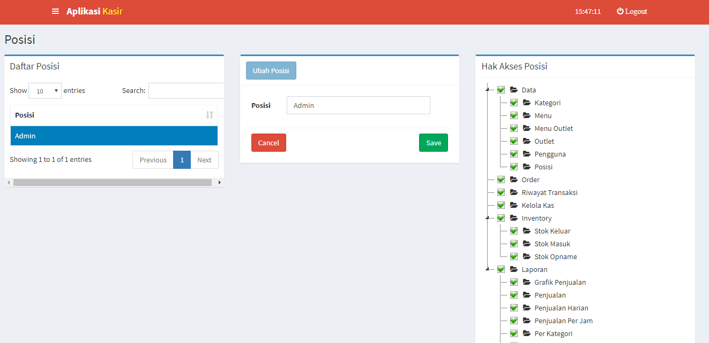

# restaurant-pos
Restaurant POS is web application to manage the restaurant business flow start from set the recipe, add items, add income/expenses, set store location and etc.

# Features

- ### Dashboard

- ### Main Menu

- ### Order Page

- ### Setup Page

- ### Login Page

- ### User Management

License
----

Apache-2.0
